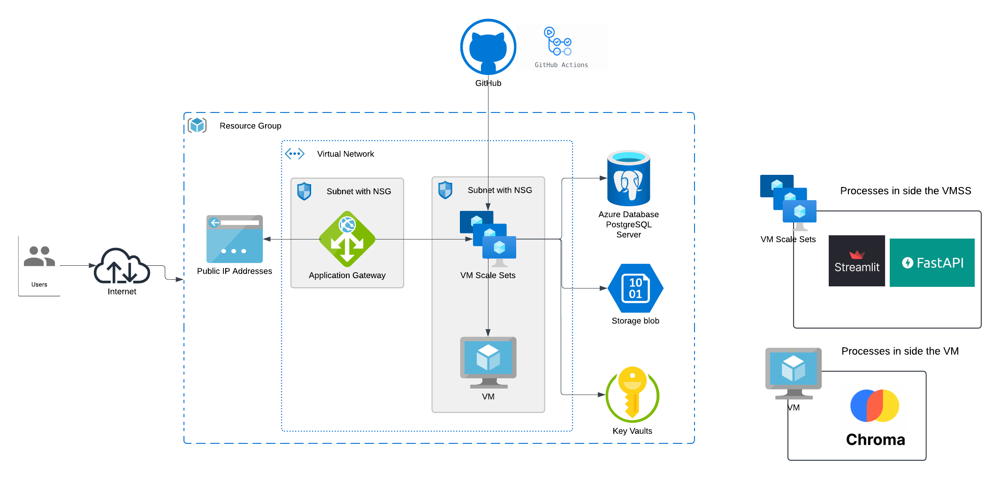

# azure-terraform-iaac-practice2

## 🚀 Azure Infrastructure with Terraform

This project deploys a complete infrastructure on **Azure** using **Terraform**, including:

- Virtual Machine (VM)  
- Virtual Machine Scale Set (VMSS)  
- Virtual Network (VNet) with 2 subnets and 2 NSGs  
- Application Gateway  
- Azure Key Vault  
- PostgreSQL  
- Blob Storage  
- Resource Group (RG)  
- Dependencies: Disk, NIC

---

## 🔧 Stack

- Terraform  
- Microsoft Azure

---

## ✅ Prerequisites

- Fill in the values in `terraform.tfvars`  
- Provide a custom image for the VM Scale Set (VMSS)

---

## 🌐 Architecture Diagram



---

## 🚀 Quick Start

```bash
terraform init
terraform apply
