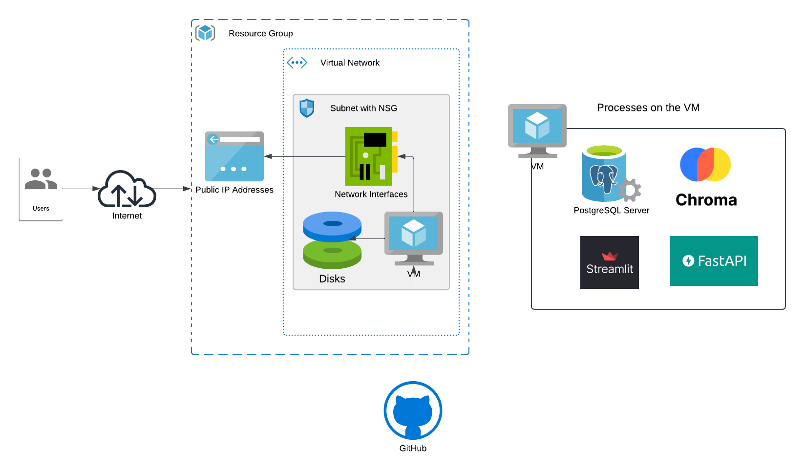

# azure-terraform-iaac-practice2

# 🚀 Azure Infra with Terraform

Deploys a full infrastructure on **Azure** using **Terraform**:

- Virtual Machine (VM)
- Virtual Network (VNet), subnet, nsg
- Resource Group (RG)
- Dependencies: Disk, NIC

### 🔧 Stack
- Terraform
- Azure


### 🌐 Diagram


### 🚀 Quick Start
```bash
terraform init
terraform apply
